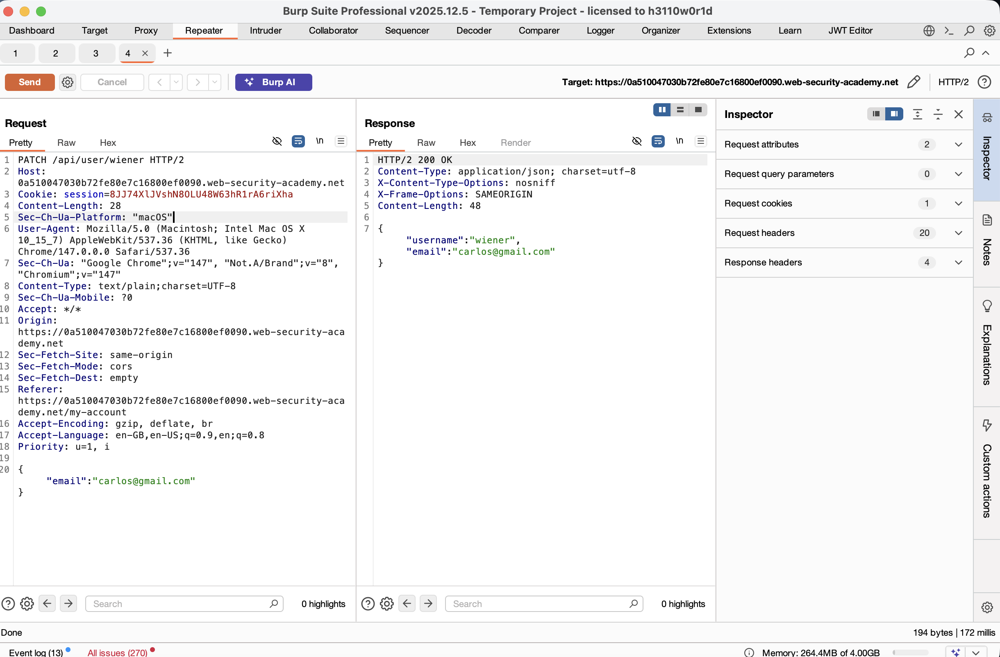
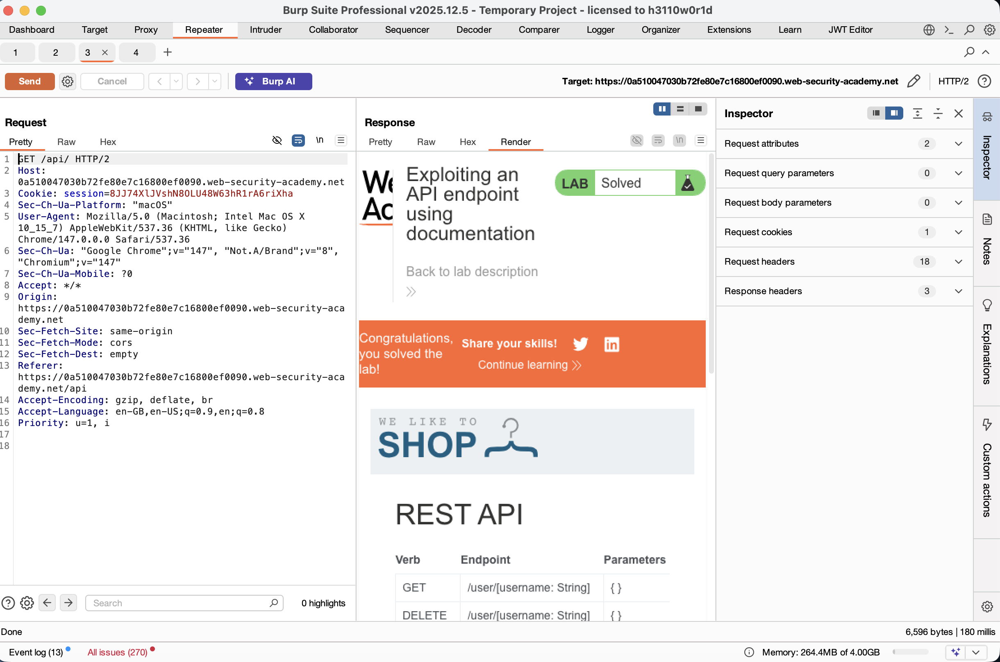
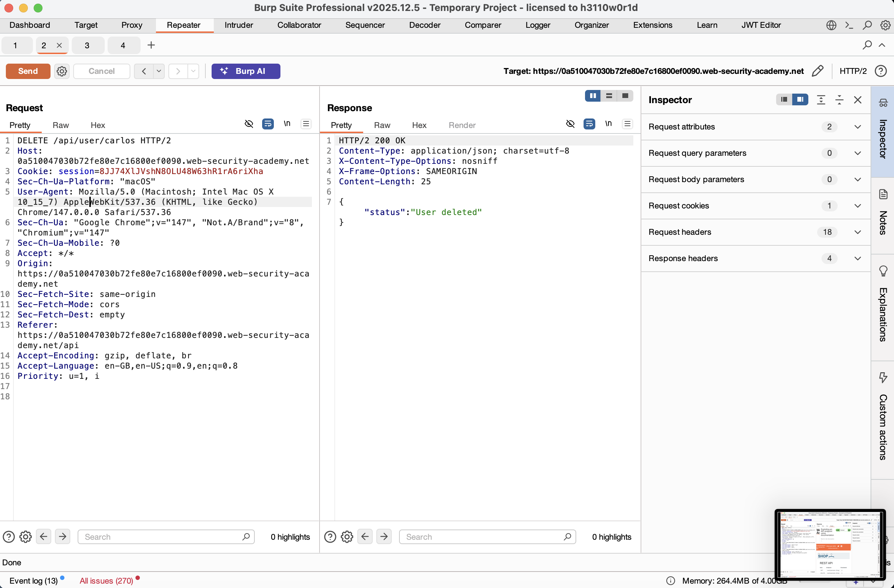
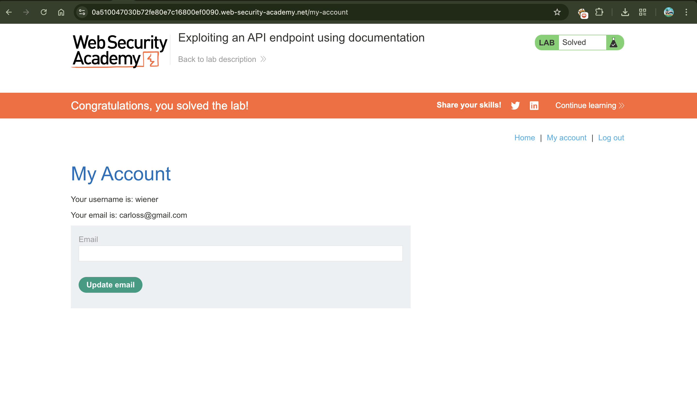

# Exploiting an API Endpoint using Documentation

## 📌 Summary
The application exposes an interactive API documentation endpoint that provides detailed information about internal API routes. By discovering this documentation, an attacker can identify hidden administrative endpoints, such as `DELETE /api/user/{username}`, and perform unauthorized actions like deleting user accounts.

---

## 🧾 Description
Information leakage occurs when sensitive documentation is left accessible to unauthorized users. In this case, by systematically removing path segments from the API URL (Path Traversal/Discovery), an internal documentation page was found at the `/api` endpoint.

This documentation describes all available methods, parameters, and authentication requirements, allowing an attacker to map the attack surface and execute administrative commands without prior knowledge of the system's internal structure.

---

## 🔁 Steps to Reproduce

1. Login to the application using credentials:
   ```
   wiener:peter
   ```

2. Update your email address and intercept the request:
   ```
   PATCH /api/user/wiener
   ```
   using Burp Suite.

3. Send the request to **Repeater** and analyze the response.

4. Modify the path by removing `/wiener` to test:
   ```
   /api/user
   ```
   Observe the error response.

5. Discover Documentation:
   Modify the path again to:
   ```
   /api
   ```
   Send the request to reveal the API documentation.

6. Right-click the response and select:
   ```
   Show response in browser
   ```
   to view the interactive documentation.

7. Identify the `DELETE` method used for deleting users.

8. Input the target username:
   ```
   carlos
   ```
   into the documentation's interactive field and click **Send Request**.

---

## 📸 Proof of Concept (PoC)

1. Discovering Vulnerable API


2. Discovering the API Documentation  


3. Successful Deletion of Carlos  


4. Lab solved



---

## 💥 Impact

- **Exposed API Documentation**  
  Reduces the effort required for an attacker to find vulnerabilities.

- **Unauthorized Data Access**  
  Attackers can view sensitive user data.

- **Administrative Actions**  
  Unauthorized users can modify or delete accounts.

- **Full System Mapping**  
  All internal endpoints become visible, leading to further targeted attacks.

---

## 🛠️ Remediation

To secure the API:

- **Restrict Access**  
  Ensure that API documentation is not accessible in the production environment or is restricted to authorized IP addresses/users.

- **Authentication**  
  Implement strong authentication for all sensitive API endpoints (like `DELETE` or `PATCH`).

- **Security by Design**  
  Do not rely on "security through obscurity" by assuming attackers won't find your API paths.