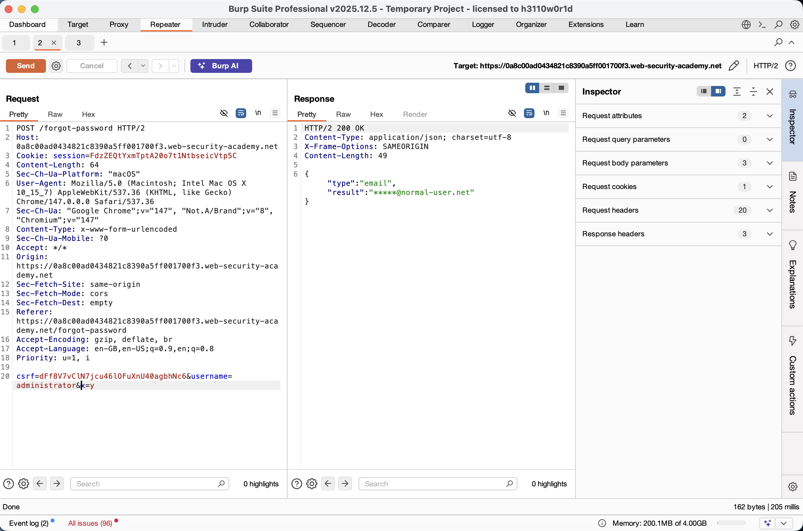
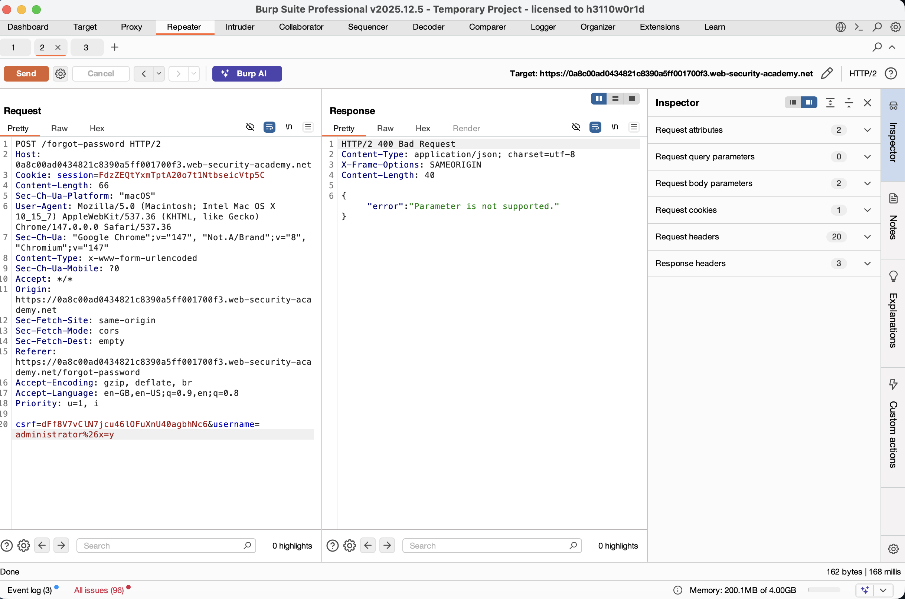
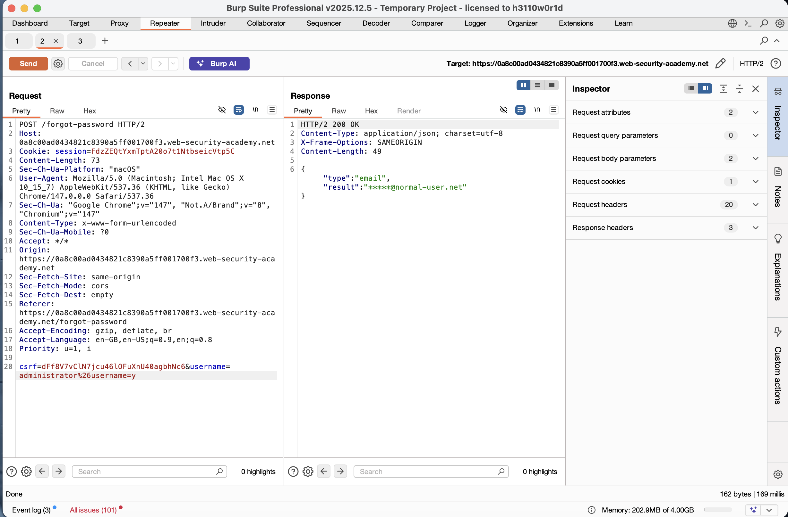
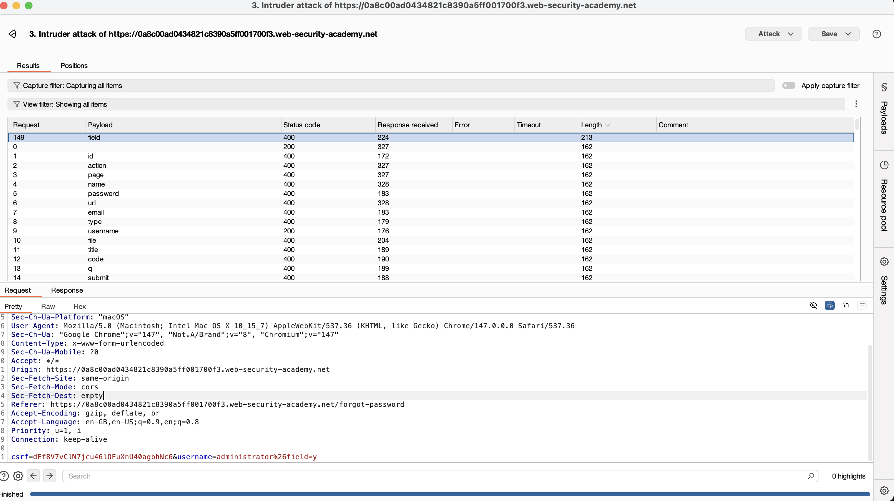
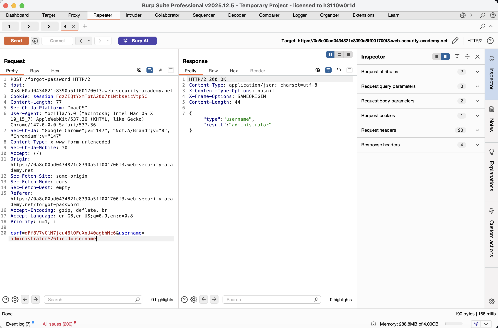
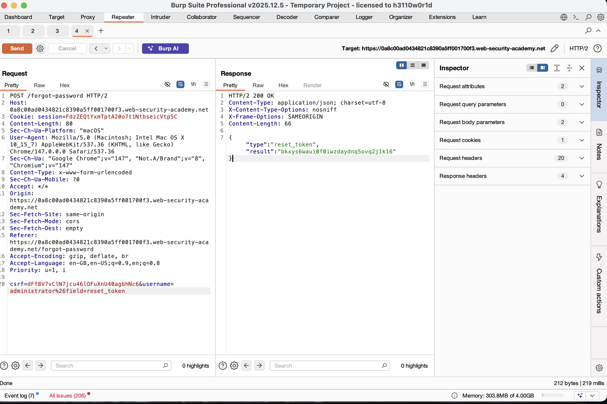
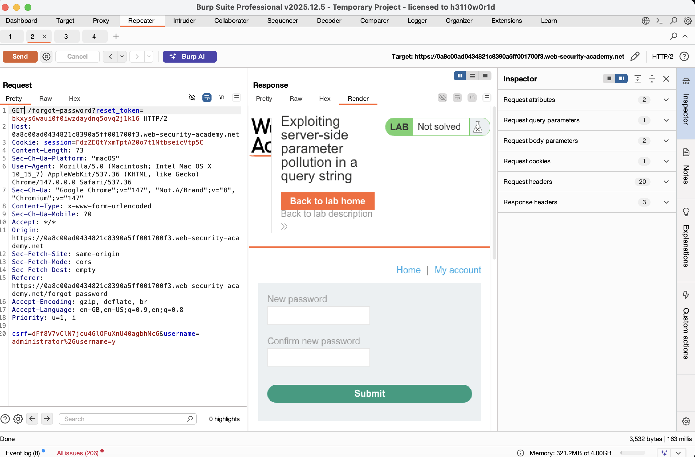
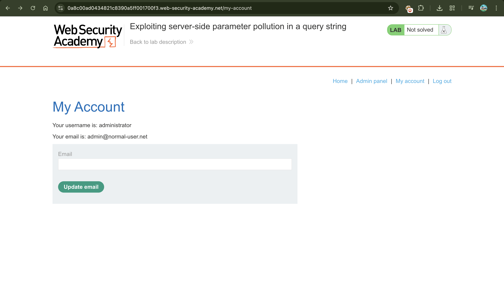
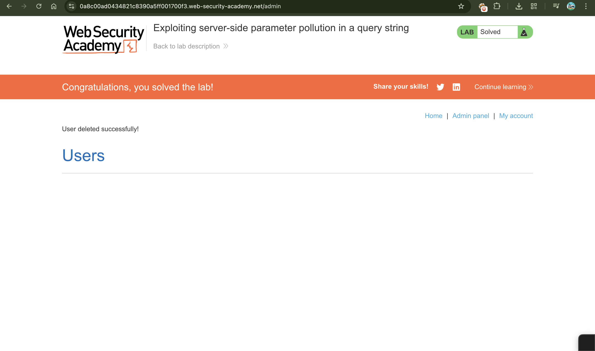

# Exploiting Server-Side Parameter Pollution in a Query String

## 📌 Summary
This lab involves exploiting **Server-Side Parameter Pollution (SSPP)**. By injecting URL-encoded characters like `&` and `#` into a query string, an attacker can manipulate the internal API request made by the server. In this case, we use this technique to override the intended API parameters and leak a password reset token for the `administrator` user.

---

## 🧾 Description
Server-side parameter pollution occurs when an application takes user input and inserts it into a server-side API request without proper sanitization. By using URL-encoded separators, we can:
1.  **Inject new parameters**: Using `%26` (URL-encoded `&`) to add extra fields to the internal query.
2.  **Truncate requests**: Using `%23` (URL-encoded `#`) to comment out the rest of the server’s intended query string.

By combining these, we discover a hidden `field` parameter that allows us to change what data the API returns, eventually forcing it to reveal a sensitive `reset_token`.

---

## 🔁 Steps to Reproduce

1.  **Intercept Password Reset**:
    Go to the "Forgot Password" page and trigger a reset for the `administrator`. Intercept the `POST /forgot-password` request in Burp Suite.

2.  **Test for Parameter Injection**:
    Send the request to **Repeater**. Try adding a second parameter by appending `%26x=y` to the username:
    `username=administrator%26x=y`
    The "Parameter is not supported" error confirms the server is parsing the injected `&`.

3.  **Identify Truncation**:
    Add `%23` (a `#` character) to the end of the username:
    `username=administrator%23`
    The "Field not specified" error suggests the server-side query originally had a `field` parameter that we just cut off.

4.  **Find the Valid Field**:
    Inject a `field` parameter and brute-force its value using **Intruder**:
    `username=administrator%26field=§x§%23`
    Using a list of common variable names, we find that `email` and `username` are valid, but we specifically need the password reset token.

5.  **Leak the Reset Token**:
    Based on the site's JavaScript (`forgotPassword.js`), we identify the parameter name `reset_token`. Modify the request to:
    `username=administrator%26field=reset_token%23`
    The server response will now contain the actual **reset token** for the admin.

6.  **Reset Password & Admin Access**:
    Use the leaked token to visit the reset URL:
    `/forgot-password?reset_token=[YOUR_LEAKED_TOKEN]`
    Set a new password, log in as `administrator`, and delete the user `carlos` from the Admin panel.

---

## 📸 Proof of Concept (PoC)

1. Discovering Vulnerable API

2. Testing Parameter Injection

3. Analyzing Field Errors

4. Brute-forcing Internal Fields

5. Confirming the Target Field

6. Leaking the Administrator Reset Token

7. Resetting the Password

8. Accessing the Admin Panel

9. Lab Solved Successfully

---

## 💥 Impact

-   **Account Takeover**: Attackers can reset passwords for any user, including administrators.
-   **Information Disclosure**: Internal API structures and sensitive fields (like tokens or private emails) are exposed.
-   **Bypassing Logic**: Attackers can change the behavior of internal backend services by injecting unauthorized parameters.

---

## 🛠️ Remediation

To secure against Parameter Pollution:

-   **Input Validation**: strictly validate user input against a whitelist of allowed characters. Do not allow URL-encoded separators like `%26` or `%23` if they aren't expected.
-   **URL Encoding**: Ensure that when the frontend communicates with the backend API, user-supplied values are properly URL-encoded so they are treated as data, not as part of the URL structure.
-   **Internal API Security**: Do not rely on the "hidden" nature of internal APIs. Implement authentication and authorization for every internal endpoint.
