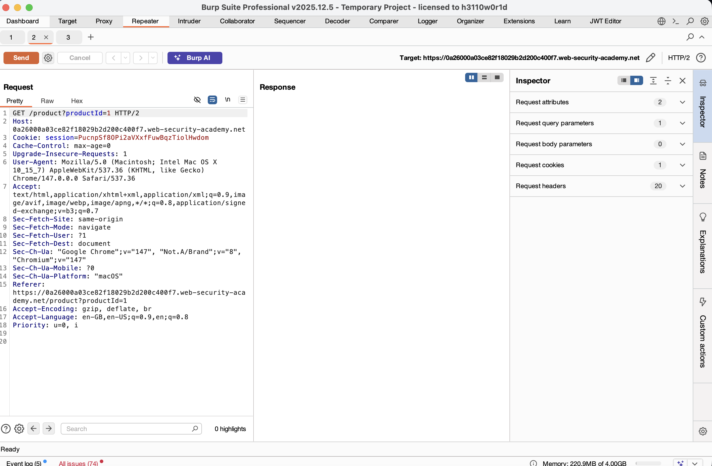
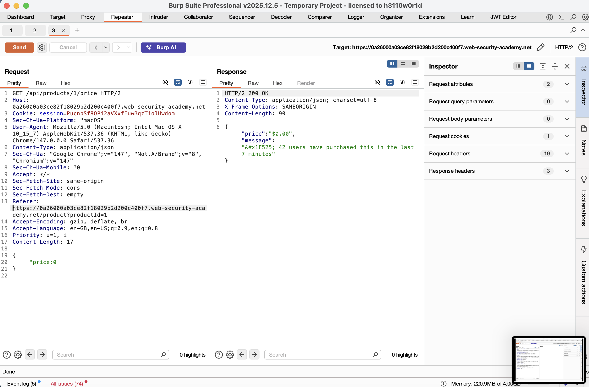
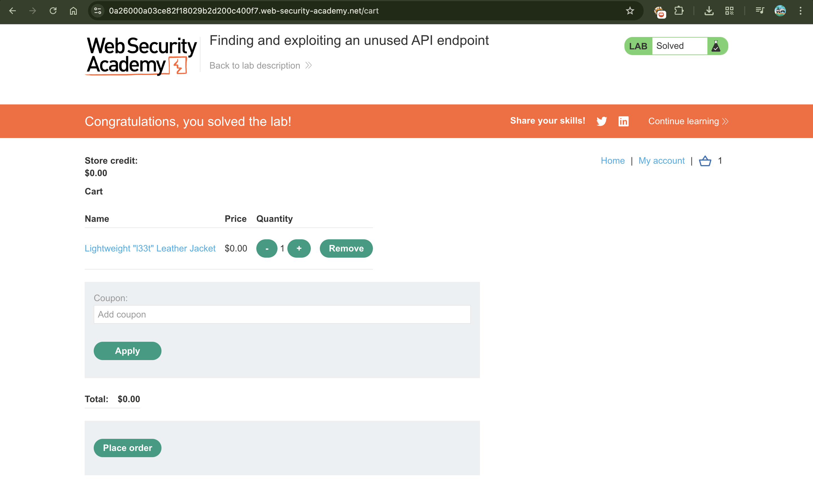

# Finding and Exploiting an Unused API Endpoint

## 📌 Summary
In this lab, I discovered and exploited a hidden API endpoint by testing different HTTP methods. By identifying that the server allowed the `PATCH` method on a product price endpoint, I was able to manipulate the price of a high-value item to $0.00 and complete the purchase.

---

## 🧾 Description
Many modern applications use RESTful APIs that support various HTTP methods (GET, POST, PUT, PATCH, DELETE). Sometimes, developers leave administrative or "unused" methods active on public endpoints. I used the `OPTIONS` method to reveal which verbs were supported and then used a `PATCH` request to modify server-side data (the product price) that should have been protected.

---

## 🔁 Steps to Reproduce

1.  **Identify the API Endpoint**:
    I browsed the shop and clicked on a product. By checking the HTTP history in Burp Suite, I identified an API call to `/api/products/1/price`.

2.  **Enumerate Allowed Methods**:
    I sent the request to **Repeater** and changed the method from `GET` to `OPTIONS`. The server responded with an `Allow` header, showing that `GET` and `PATCH` were permitted.

3.  **Test for Unauthorized Access**:
    I changed the method to `PATCH`. Initially, the server returned an "Unauthorized" error, indicating I needed to be logged in. I then logged into my account (`wiener:peter`).

4.  **Analyze Request Requirements**:
    After logging in, I sent the `PATCH` request again. The API responded with errors that helped me build a valid request:
    *   **Content-Type Error**: I added the header `Content-Type: application/json`.
    *   **Missing Parameter Error**: The error stated a `price` parameter was required.

5.  **Exploit the Vulnerability**:
    I sent a `PATCH` request with the following JSON body:
    `{"price":0}`
    The server accepted the request, and the product price was successfully updated to $0.00.

6.  **Complete the Purchase**:
    I refreshed the product page, added the "Lightweight l33t Leather Jacket" to my cart, and placed the order for free.

---

## 📸 Proof of Concept (PoC)

1. Capturing the Product API Request  

2. Modifying the Price via PATCH  

1. Lab Solved Successfully  

---

## 💥 Impact

-   **Financial Loss**: Unauthorized price manipulation allows attackers to purchase items for any amount, including free.
-   **Data Integrity**: Attackers can modify server-side data fields that should be read-only for standard users.
-   **Broken Access Control**: Sensitive administrative methods (like PATCH or DELETE) are exposed to regular users.

---

## 🛠️ Remediation

-   **Disable Unused Methods**: Configure the server to only allow the specific HTTP methods required for each endpoint (e.g., if a user only needs to view a price, only allow `GET`).
-   **Implement Robust Authorization**: Check user permissions for every request method. A standard user should never be authorized to use `PATCH` on a product's price.
-   **Input Validation**: Validate all incoming API data against a strict schema to prevent unexpected parameter modifications.